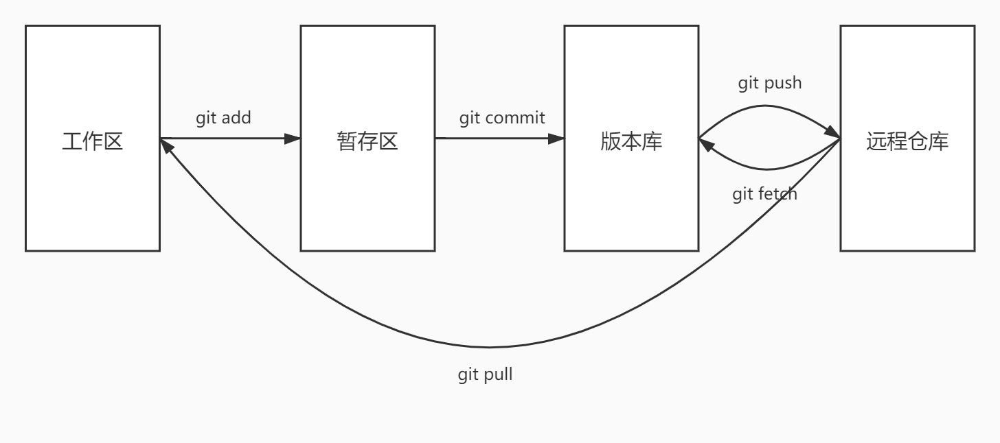
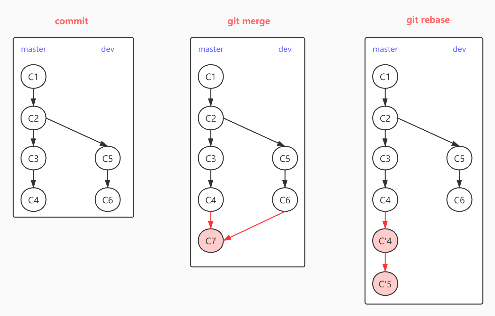
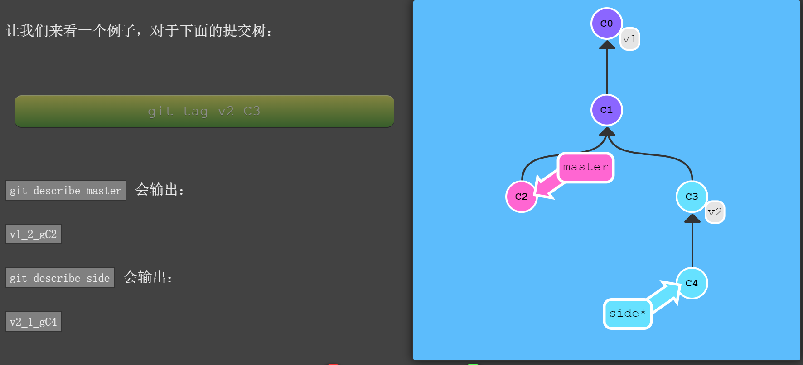
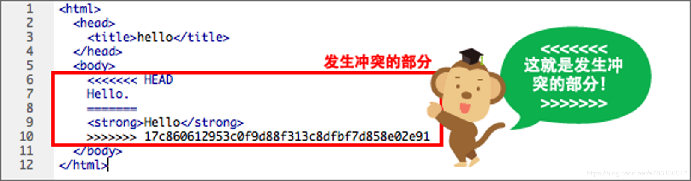

<a href="#1">1. 学习推荐</a>

<a href="#2">2. Git的工作区域 ☆</a>

<a href="#3">3. 命令详解</a>

<a href="#4">4. Q&A</a>

<a id="1"/>

## 1. 学习推荐
- [学习Git命令的网站](http://learngitbranching.js.org/)：循序渐进闯关式，游戏+图形化界面，比较易懂。大概3h可以掌握完毕~!
- [廖雪峰的Git教程](https://www.liaoxuefeng.com/wiki/896043488029600)

<a id="2"/>

## 2. Git的工作区域 ☆
 很多人搞不清Git的命令，是因为对Git的工作区域不了解。Git共有4个工作区域：工作区、暂存区、版本库和远程仓库。

> 工作区：就是当前写代码，肉眼常看到的区域
暂存区：临时存放你的变动，`git add` 即把文件添加到暂存区
版本库：本地安全存放数据的地方，`git commit`即把文件添加到版本库（`HEAD`）
远程仓库：远程托管代码的服务器，`git push`上去后就不用担心数据丢失了

<a id="3"/>

## 3. 命令详解
### 3.1 track状态
1）`git status` （我最常用的命令之一）
显示工作区和暂存区的状态（告诉你哪些文件到暂存区了，哪些文件没有被Git tracked到）
2）`git diff`（建议在`git add`前运行一下）
- 不带参数的`git diff` - 显示当前工作区和暂存区间的差异
- `git diff HEAD` - 显示当前工作区和本地版本库间的差异
- `git diff origin/master` 你可以在`git fetch`拉取远端最新代码后，执行这个命令。此时可看到工作区和远程master（i.e. 本地版本库的master）间的差异

### 3.2 分支切换
`git checkout -b <user branch>` 创建分支名为`user branch`的新分支

- 更准确来说，是基于当前所在的分支创建新分支
- `git branch <user branch>` 切换到分支`user branch`
- `git checkout -b <user branch> origin/<branch1>` - 创建新分支，追踪于远端分支`branch1`（最好先运行`git fetch`，将本地版本库的`branch1`与远端同步）
    * 设置远端追踪`git branch -u <originbranch> [<user branch>]`
 
### 3.3 拉取远端
1）`git fetch` 单纯的把远程仓库更新到本地版本库
- 命令：`git fetch origin <source>:<destination>`
    - 栗子：`git fetch origin <user branch>` 到远程仓库的`<user branch>`上，获取所有本地不存在的提交放到本地的`origin/<user branch>`上

2）`git pull` = `git fetch` + `git merge`拉取远端更新到工作区并merge

- 不带参数的`git pull`，即拉取+merge*本地分支所追踪的*远程分支到工作区
- `git pull origin <branch1>`，即拉取+merge远端分支`branch1`到工作区，常见的是`git pull origin master`
- `git pull --rebase` - 远端拉到本地直线历史

### 3.4 修改文件与提交 ☆ 
1）`git add` 添加你修改的文件到暂存区

- `git add <文件路径>` - 添加单个文件
- `git add .` - 添加你修改的所有文件

2）`git commit -m "添加的注释内容"` 将已add的文件推送到本地版本库

- `git commit --amend` - 推送到最近的一个的commit版本上，并可以修改commit上的注释内容等信息

3）`git push`
- `git push` - 直接push到本地分支所追踪的远程分支（若本地当前没有所追踪的远程，通常会提示你用此命令进行push：`git push--set-upstream origin <user branch>`）
- `git push origin <branch1>` 切换到本地版本库的`<branch1>`，获取所有提交，再到远程仓库`origin`中找到`branch1`分支，将本地的记录添加上去
- 命令：`git push origin <source>:<destination>`
    -  栗子：`git push origin HEAD:<branch1>` - 当前分支的`HEAD`，push到远端的`branch1`分支
    - `git push origin :branch` - push空的source到远端
删除远程的`branch`和本地的`origin/branch`

### 3.5 合并分支
`git merge`和`git rebase`都可用来合并分支。

如上图所示：
>`git rebase` - "复制"一系列的提交记录（C4和C5），然后在另一个地方逐个放下去。
>- 优点：使提交树很干净， 所有的提交都在一条线上
>- 缺点：修改了提交树的历史（即看不到`dev`分支）

命令说明：`git rebase <targetbranch> [<sourcebranch>]` 创建当前分支的副本，"复制"到`targetbranch`最顶端

### 3.6 撤销变更
1）`git reset`强制更改历史，覆盖提交树。（慎用！！）
- 需要参数`--hard`。执行此命令后，除非知道历史`commit id`，否则很难找回历史。
- 命令：`git reset --hard origin/<user branch>`或`git reset --hard <commit id>`

2）`git revert`多了一个新提交
- 多生成一个commit说明（表明已改写历史）
- 命令：`git revert HEAD` 或 `git revert HEAD^` （参见下一节的相对引用）

### 3.7 其他
1）`HEAD` 指向本地版本库的最近一次提交记录
-  查看`HEAD` 的指向：`cat .git/HEAD`
 - 如果`HEAD` 指向的是引用，可用`git symbolic-ref HEAD`查看它的指向
分离的 `HEAD` : 
- 若`HEAD` 指向了某个具体提交记录而不是分支名（`git checkout <hash>`即会导致此情况），则不允许执行`git commit`

2）相对引用 - 可以通过它指定合并提交记录的某个父提交
- `^` - 向上移动1 个提交记录  e.g `HEAD^`，`master^`（master 的父节点）和`master^^`（master的第二个父节点）
- `~<num>` 向上移动多个提交记录  e.g `HEAD~3`
- 举个栗子：将master分支强制指向HEAD的第3级父提交 => `git branch -f master HEAD~3`

3）Git Tag - 提交树上的一个锚点，标识了某个特定位置
- `git tag v1 <hash>`
- `git describe <ref>`
    * 输出：`<tag>_<numCommits>_g<hash>` - 描述离你最近的锚点（标签）
    *`tag`: 离 ref 最近的标签
    *`numCommits`:  ref 与 tag 相差有多少个提交记录
    *`hash`: 所给定的 ref 所表示的提交记录哈希值的前几位
    * PS. 当 ref 提交记录上有某个标签时，则只输出标签名称

<a id="4"/>

## 4. Q&A
### 4.1 merge冲突
举个栗子：`Automatic merge failed`
解答：
1）运行`git status`你可以看到有些文件被`Both modified` - 即冲突的文件（本地数据库和远程仓库均有变动）
2）打开有冲突的文件，自行解决冲突（保留你想保留的代码）
 - Tip - 可以用VS Code打开有冲突的文件（可视性更强 - 有"Accept incoming changes",...等选项）

> （本地数据库的变动内容）
> ====== 分割线 ====== 
（远程仓库的变动内容）

3）运行`git add .`和 `git commit -m "Merge with <branch name> and fix merge conflicts"`